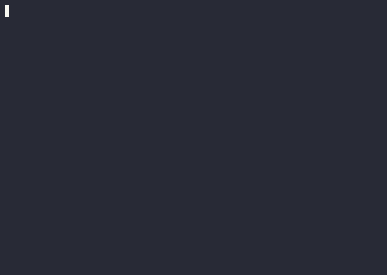

# HyperPrune

> The fastest perfect-play Tic-Tac-Toe engine built from scratch — negamax alpha-beta, bitboards, killer moves, history heuristics, and Zobrist-hashed transposition tables, with no precomputed lookup tables. Deterministic perfect play from 3×3 to 8×8.

[](https://github.com/PavolUlicny/HyperPrune/actions/workflows/test.yml)



## Highlights

- Bitboard representation — win detection via bitwise AND against precomputed masks
- Negamax with alpha-beta pruning — reduces the search tree from O(b^d) toward O(b^(d/2))
- Zobrist-hashed transposition table — ~99.9% hit rate on 3×3, avoiding redundant re-evaluation
- Killer-move and history heuristics for move ordering — measurable throughput gains
- Profile-guided optimization (PGO) target for peak performance
- Verified perfect play on 3×3 and 4×4 (100% ties) across Linux, macOS, and Windows in CI
- ~7.3 M games/s (3×3 release), ~8.2 M games/s (3×3 PGO) on AMD Ryzen 7 8845HS

## Requirements

- C11 compiler (GCC, Clang, or MSVC)
- Platform: Linux, macOS, Windows (x64), BSD, WSL
- Build system: Make (Unix) or CMake (cross-platform)

## Quick start

```sh
make
./ttt
```

## Prebuilt binaries

Download the latest release from the [Releases](https://github.com/PavolUlicny/HyperPrune/releases) page.

On Linux and macOS, mark the binary executable before running:

```sh
chmod +x ttt-linux-x86_64   # or ttt-macos-arm64
./ttt-linux-x86_64
```

Windows binaries can be run directly. Released binaries are compiled for 3×3. For other board sizes, compile from source.

## Build

### Unix (Linux, macOS, BSD) - Makefile

```sh
make              # Default release build
make debug        # Debug build with symbols
make release      # Optimized release build
make portable     # Portable build: no -march=native; statically linked on Linux
make pgo          # Profile-guided optimization
make install      # Install to /usr/local/bin (override with PREFIX=...)
make uninstall    # Remove installed binary
```

Board size (3–8):

```sh
make BOARD_SIZE=4
make pgo BOARD_SIZE=5
```

### Cross-platform - CMake

```sh
# Linux/macOS (default portable build)
cmake -B build -DBOARD_SIZE=3 -DCMAKE_BUILD_TYPE=Release
cmake --build build
./build/ttt

# Linux/macOS (optimized for native CPU)
cmake -B build -DBOARD_SIZE=3 -DCMAKE_BUILD_TYPE=Release -DENABLE_NATIVE_OPTIMIZATIONS=ON
cmake --build build
./build/ttt

# Windows (MSVC)
cmake -B build -DBOARD_SIZE=3 -DCMAKE_BUILD_TYPE=Release
cmake --build build --config Release
.\build\Release\ttt.exe
```

**Native optimizations:**

The `ENABLE_NATIVE_OPTIMIZATIONS` CMake option adds micro-tuning flags (`-march=native`, `-flto`, `-funroll-loops`, etc.) for maximum performance on the build machine. The optimization level (`-O3`) comes from `CMAKE_BUILD_TYPE=Release` — using this flag without `Release` compiles at `-O0`. Use `ON` for local builds, `OFF` (default) for portable binaries.

### Manual build

```sh
# Unix (GCC/Clang)
gcc -std=c11 -O3 -march=native -flto -DBOARD_SIZE=3 \
  src/main.c src/TicTacToe/tic_tac_toe.c \
  src/Negamax/negamax.c src/Negamax/transposition.c \
  -o ttt -lm

# Windows (MSVC)
cl /std:c11 /O2 /DBOARD_SIZE=3 \
  src\main.c src\TicTacToe\tic_tac_toe.c \
  src\Negamax\negamax.c src\Negamax\transposition.c \
  /Fe:ttt.exe
```

## Usage

### Interactive mode

```sh
./ttt
```

- Choose X or O
- Enter moves as column and row numbers (1-indexed)
- Ctrl+D exits

### Self-play

```sh
./ttt --selfplay [GAMES]
./ttt -s 5000
./ttt -s 10000 -q
```

### CLI options

```text
--help, -h                    Show help and exit
--selfplay, -s [GAMES]        Run self-play mode (default: 1000 games)
--quiet, -q                   Suppress output (requires --selfplay)
--tt-size SIZE, -t SIZE       Transposition table size in entries (0 to disable)
--seed SEED, -S SEED          PRNG seed for Zobrist keys (default: fixed internal seed)
```

### Examples

```sh
./ttt
./ttt --selfplay 5000
./ttt -s 20000 -q
./ttt -S 42 -s 1000
./ttt -t 50000000 -s 10000
./ttt -t 0 -s 1000              # Benchmark without TT
```

## How it works

HyperPrune is built around five compounding optimizations:

**Bitboard representation** — The board is two `uint64_t` fields (`x_pieces`, `o_pieces`), one bit per cell. Win detection checks `2×N + 2` precomputed masks (N rows, N columns, two diagonals) with a single bitwise AND each — no per-cell iteration.

**Negamax with alpha-beta pruning** — A single recursive function replaces separate min/max functions; every score is relative to the player-to-move, and the parent receives `-negamax(child)`. Alpha-beta pruning skips branches that cannot affect the result, reducing the search tree from O(b^d) toward O(b^(d/2)) in the best case.

**Zobrist-hashed transposition table** — Every evaluated position is stored by a 64-bit Zobrist hash. On 3×3, the TT hit rate reaches ~99.9%, meaning the engine almost never re-evaluates a position it has seen before. The hash includes a side-to-move key: without it, the same board reached at different depths across separate `getAiMove()` calls hashes identically but requires a different score, producing non-optimal moves.

**Killer-move and history heuristics** — Move ordering determines how quickly alpha-beta finds cutoffs. The engine keeps two killer slots per depth — moves that recently caused a cutoff at that depth — and tries them before all others. Remaining moves are ordered by cumulative beta-cutoff count (history). Better ordering means more pruning.

**Profile-guided optimization** — `make pgo` compiles the binary twice: once instrumented to collect a real execution profile, then again with that profile fed back to the compiler for targeted inlining and branch-prediction hints.

## Testing

The test suite uses Unity and ships with the repo.

**Makefile (Unix):**

```sh
make test
make BOARD_SIZE=4 test
```

**CMake (cross-platform):**

```sh
cmake -B build -DBOARD_SIZE=3 -DCMAKE_BUILD_TYPE=Release
cmake --build build
ctest --test-dir build --output-on-failure
```

The test runner is built at `test/test_runner` (Makefile) or `build/test_runner` (CMake).

## API usage (library-style)

The engine can be used directly from the public headers:

- `TicTacToe/tic_tac_toe.h` for board state, move helpers, and win checks
- `Negamax/negamax.h` for `getAiMove()`
- `Negamax/transposition.h` for Zobrist + transposition table

Minimal init and loop (0-based coordinates):

```c
#include "TicTacToe/tic_tac_toe.h"
#include "Negamax/negamax.h"
#include "Negamax/transposition.h"

int main(void)
{
    init_win_masks();
    zobrist_init();
    transposition_table_init(100000);

    Bitboard board = {0, 0};
    int row = -1, col = -1;
    getAiMove(board, 'x', &row, &col);

    transposition_table_free();
    return 0;
}
```

Compile with `-Isrc` to include the headers:

```sh
gcc -std=c11 -Isrc -DBOARD_SIZE=3 your_program.c \
  src/TicTacToe/tic_tac_toe.c \
  src/Negamax/negamax.c \
  src/Negamax/transposition.c \
  -o your_program -lm
```

Notes:

- Call `zobrist_set_seed()` before `zobrist_init()` if you want a custom seed.
- `getAiMove()` returns `(-1, -1)` on terminal positions.
- `BOARD_SIZE` is compile-time; it must match across all objects.

## Performance notes

Benchmarked on AMD Ryzen 7 8845HS (performance governor):

| Board | Release        | PGO            |
|-------|----------------|----------------|
| 3×3   | ~7.3 M games/s | ~8.2 M games/s |
| 4×4   | ~2.3 M games/s | ~2.8 M games/s |

- Fastest build: `make pgo`
- Released binaries are compiled for 3×3. For other board sizes, compile from source with `make BOARD_SIZE=N`
- Large boards grow exponentially: 5×5 takes on the order of minutes per move; 6×6+ is impractical without further pruning improvements
- Default transposition table sizing is automatic; override with `--tt-size`

## Project structure

```text
src/
├── main.c                    # Entry point and CLI
├── TicTacToe/                # Board logic and I/O helpers
└── Negamax/                  # Search and transposition table
test/
└── unity/                    # Unity test framework
```

## Changelog

See [CHANGELOG.md](CHANGELOG.md) for release history.

## License

MIT License - see [LICENSE](LICENSE).
